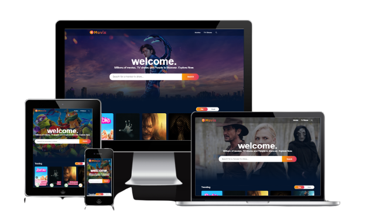

<p align="center">
  
</p>


# Movie App

This is a web application that utilizes the TMDB API to display information about movies. It is built using React and incorporates various tools and libraries.

## Tools and Libraries Used

- Redux/toolkit: State management library.
- Axios: HTTP client for making API requests.
- Dayjs: Library for parsing, validating, manipulating, and formatting dates.
- React: JavaScript library for building user interfaces.
- React-circular-progressbar: Circular progress bar component for React.
- React-dom: Package for working with the DOM in React applications.
- React-icons: Library for including icons in React applications.
- React-player: React component for playing videos.
- React-lazy-load-image-component: Component for lazy-loading images in React.
- Sass: CSS extension language.

## Installation

1. Clone the repository:

   ```bash
   git clone <repository-url>
   ```

2. Navigate to the project directory:

   ````bash
   cd movie-app
   ```

3. Install the required dependencies:

   ````bash
   npm install
   ```

4. Start the development server:

   ````bash
   npm start
   ```

   The application will be available at: `http://localhost:5173/`.

## Demo

You can find a live demo of the Movie App [here](https://movix-ui.netlify.app/).


<p align="center">
  
</p>


## Features

- Display a list of movies with details such as title, release date, and overview.
- Ability to search for movies by title.
- Show movie details when a movie is selected.
- Play movie trailers.
- Display loading progress while fetching data.
- Responsive design for different screen sizes.

